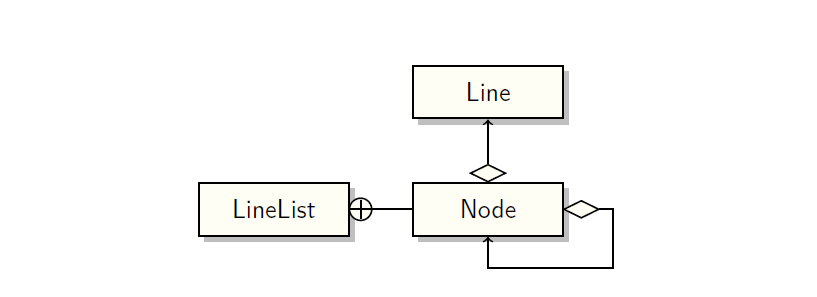

A Line-List data Structure to store multiple text lines, that will provide a subset of the services provided by the C++ standard *<string*> class and the list *<string*> class template.

# Line-List-Class
A class that represent a linked list of text lines.

# CLass Diagram

  
# Node-Class
A class that models nodes in the Line List class. It stores a Line object and two pointers to preceeding and succeeding nodes, if any.

# Line-Class
A class that models a line of text, storing it in a dynamically created array of characters. It has <string> like function implementations but does not use C++ string class.

It covers the following topics:

Arrays, pointers, dynamic memory allocation and deallocation,linked list, doubly linked list, input file processing,
and writing classes.
